# Awesome Agent Benchmarks

A curated list of benchmarks for evaluating AI agents. Scoped to three domains: games, robotics, and computer use.

## Contents

- [Games](#games)
- [Robotics](#robotics)
- [Computer Use](#computer-use)
- [Contributing](#contributing)
- [Related Work](#related-work)

---

## Games

Interactive environments — primarily 2D — for training and evaluating decision-making agents on exploration, planning, and generalization.

| Preview | Name | Year | Description |
| --- | --- | --- | --- |
| 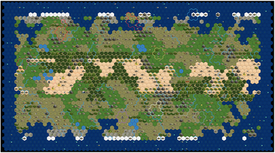 | [Terra Nova](https://arxiv.org/abs/2511.15378) | 2025 | Civilization-V-inspired challenge environment combining partial observability, credit assignment, and huge action spaces. |
| 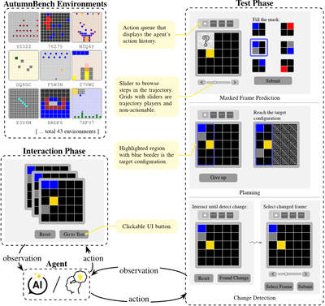 | [AutumnBench](https://arxiv.org/abs/2510.19788) | 2025 | 43 interactive grid-world environments and 129 tasks evaluating world-model learning via reward-free exploration. |
| 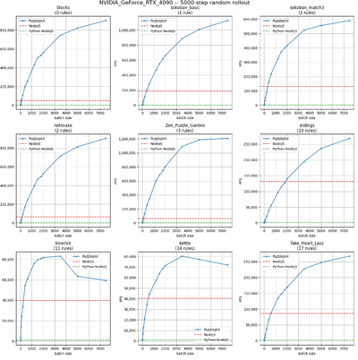 | [PuzzleJAX](https://arxiv.org/abs/2508.16821) | 2025 | GPU-accelerated puzzle game engine benchmarking RL, tree search, and LLM reasoning across hundreds of games. |
|  | [Kaggle Game Arena](https://www.kaggle.com/game-arena) | 2025 | Head-to-head leaderboard pitting LLMs against each other in strategic games (chess, Werewolf, poker). |
|  | [ARC-AGI-3](https://arcprize.org/arc-agi/3) | 2025 | Interactive reasoning benchmark where agents explore novel games, acquire goals on the fly, and adapt. |
| 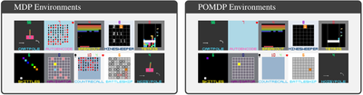 | [POPGym Arcade](https://arxiv.org/abs/2503.01450) | 2025 | Atari-inspired hardware-accelerated pixel environments for analyzing agent memory under partial observability. |
| 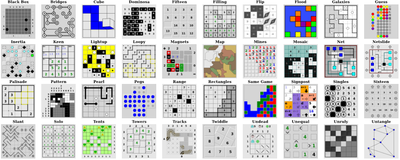 | [PUZZLES](https://arxiv.org/abs/2407.00401) | 2024 | 40 Simon Tatham logic puzzles of adjustable size benchmarking algorithmic and logical reasoning in RL. |
| 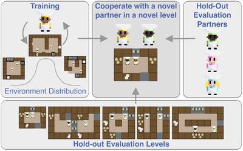 | [Overcooked Generalisation Challenge](https://arxiv.org/abs/2406.17949) | 2024 | Overcooked-AI extension benchmarking RL cooperation with novel partners across procedurally generated kitchens. |
| 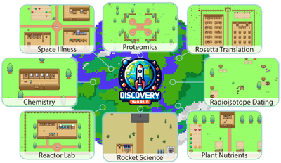 | [DiscoveryWorld](https://arxiv.org/abs/2406.06769) | 2024 | Text-based environment with 120 tasks requiring agents to form hypotheses, run experiments, and conclude discoveries. |
| 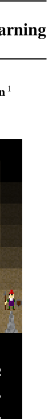 | [Craftax](https://arxiv.org/abs/2402.16801) | 2024 | JAX-based open-world benchmark extending Crafter with NetHack-inspired mechanics for fast open-ended RL research. |
| 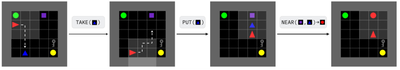 | [XLand-MiniGrid](https://arxiv.org/abs/2312.12044) | 2023 | JAX-based grid-world suite with millions of pre-sampled tasks for meta-reinforcement learning research. |
| 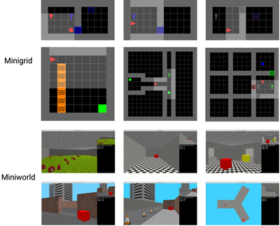 | [Minigrid & Miniworld](https://arxiv.org/abs/2306.13831) | 2023 | Modular 2D grid-world and 3D first-person environments for fast goal-oriented RL research. |
| 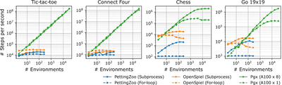 | [Pgx](https://arxiv.org/abs/2303.17503) | 2023 | JAX-based suite of GPU/TPU-accelerated board games (chess, Go, shogi, backgammon) for RL. |
| 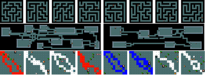 | [MiniHack](https://arxiv.org/abs/2109.13202) | 2021 | Sandbox for designing custom NetHack-based RL environments targeting exploration, transfer, and specific capabilities. |
| 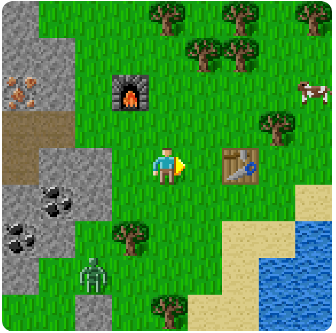 | [Crafter](https://arxiv.org/abs/2109.06780) | 2021 | Open-world 2D survival game evaluating diverse agent capabilities via semantically meaningful achievements. |
| 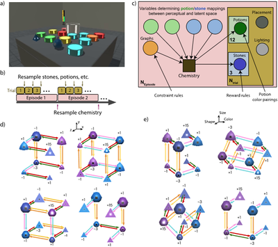 | [Alchemy](https://arxiv.org/abs/2102.02926) | 2021 | 3D Unity meta-RL benchmark with resampled latent causal structure for structure learning and hypothesis testing. |
|  | [Virtual Tools](https://www.pnas.org/doi/10.1073/pnas.1912341117) | 2020 | Tool-use puzzle game probing flexible, creative physical problem solving and reasoning. |
| 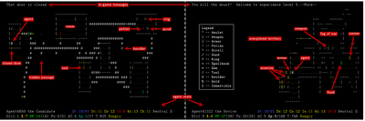 | [NetHack Learning Environment](https://arxiv.org/abs/2006.13760) | 2020 | Scalable, procedurally-generated roguelike environment for long-horizon exploration, planning, and skill-acquisition RL. |
| 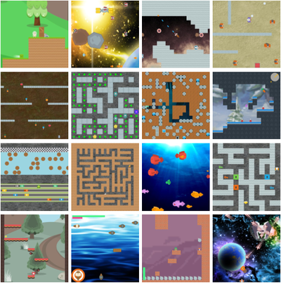 | [Procgen](https://arxiv.org/abs/1912.01588) | 2019 | 16 procedurally-generated game-like environments benchmarking RL sample efficiency and generalization. |
| 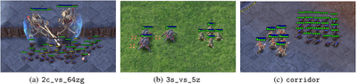 | [SMAC](https://arxiv.org/abs/1902.04043) | 2019 | StarCraft II micromanagement benchmark for cooperative multi-agent deep reinforcement learning. |
| 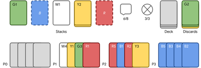 | [Hanabi Learning Environment](https://arxiv.org/abs/1902.00506) | 2019 | Cooperative card game benchmark requiring multi-agent coordination and theory-of-mind under partial information. |
| 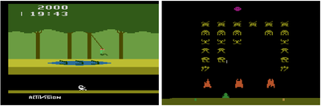 | [Atari (ALE)](https://arxiv.org/abs/1207.4708) | 2012 | Interface to hundreds of Atari 2600 games; canonical general-agent and RL evaluation platform. |

---

## Robotics

Physics-based simulation (and real-robot) benchmarks covering manipulation, locomotion, and physical reasoning.

| Preview | Name | Year | Description |
| --- | --- | --- | --- |
| 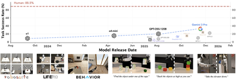 | [CaP-X](https://arxiv.org/abs/2603.22435) | 2026 | Code-as-policy robot-manipulation benchmark with 100+ tasks evaluating LLMs/VLMs generating control code from natural language. |
|  | [KinDER](https://prpl-group.com/kinder-site/) | 2026 | 25 procedurally-generated 2D/3D environments isolating kinematic and dynamic physical reasoning challenges. |
| 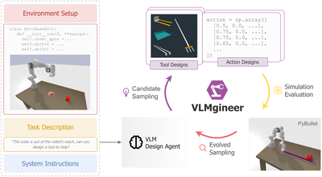 | [VLMgineer](https://arxiv.org/abs/2507.12644) | 2025 | Framework using VLMs with evolutionary search to co-design physical tools and action plans. |
| 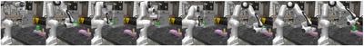 | [VLABench](https://arxiv.org/abs/2412.18194) | 2025 | 100 language-conditioned manipulation task categories evaluating VLAs on long-horizon reasoning and world knowledge. |
| 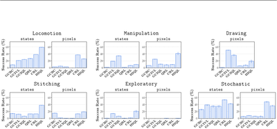 | [OGBench](https://arxiv.org/abs/2410.20092) | 2025 | Offline goal-conditioned RL benchmark with 8 environments probing stitching and long-horizon reasoning. |
| 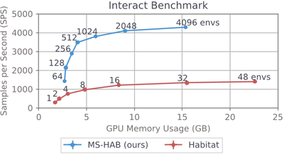 | [ManiSkill-HAB](https://arxiv.org/abs/2412.13211) | 2025 | GPU-accelerated low-level manipulation benchmark for in-home object rearrangement with RL/IL baselines. |
| 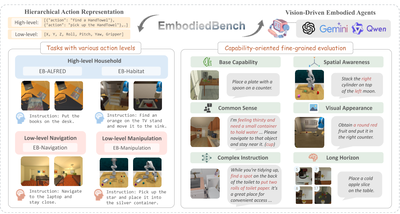 | [EmbodiedBench](https://arxiv.org/abs/2502.09560) | 2025 | 1,128 tasks across four environments evaluating multi-modal LLMs as vision-driven embodied agents. |
| 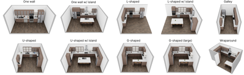 | [RoboCasa](https://arxiv.org/abs/2406.02523) | 2024 | Large-scale kitchen-focused simulation with 100 tasks and diverse assets for generalist robots. |
| 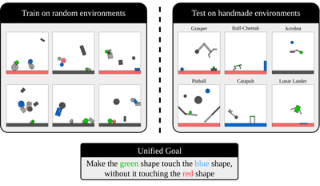 | [Kinetix](https://arxiv.org/abs/2410.23208) | 2024 | Open-ended procedurally-generated 2D physics-based tasks for training general RL agents. |
| 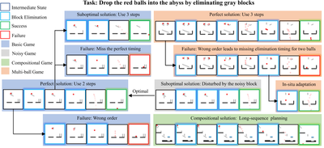 | [I-PHYRE](https://arxiv.org/abs/2312.03009) | 2024 | Interactive physical reasoning requiring intuitive physics, multi-step planning, and in-situ intervention. |
| 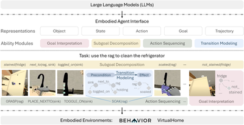 | [Embodied Agent Interface](https://arxiv.org/abs/2410.07166) | 2024 | Unified interface benchmarking LLM modules (goals, subgoals, actions, transitions) for embodied decision making. |
|  | [DittoGym](https://arxiv.org/abs/2401.13231) | 2024 | RL benchmark for reconfigurable soft robots requiring fine-grained morphology changes within an episode. |
| 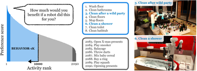 | [BEHAVIOR-1k](https://arxiv.org/abs/2403.09227) | 2024 | 1,000 human-grounded everyday activities simulated with realistic physics via OmniGibson. |
| 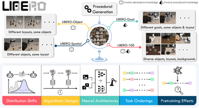 | [LIBERO](https://arxiv.org/abs/2306.03310) | 2023 | Lifelong robot-manipulation benchmark probing declarative and procedural knowledge transfer across tasks. |
| 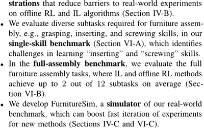 | [FurnitureBench](https://arxiv.org/abs/2305.12821) | 2023 | Reproducible real-world furniture assembly benchmark for long-horizon complex robot manipulation. |
| 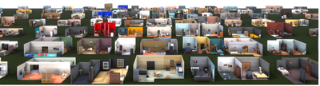 | [ProcTHOR](https://arxiv.org/abs/2206.06994) | 2022 | Procedurally generates large-scale interactive houses for embodied-AI navigation, rearrangement, and manipulation. |
| 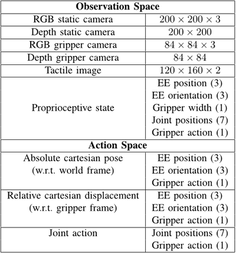 | [CALVIN](https://arxiv.org/abs/2112.03227) | 2021 | Open-source simulated benchmark for long-horizon language-conditioned robot manipulation from onboard sensors. |
| 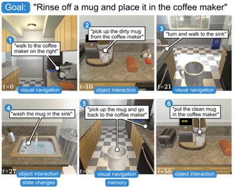 | [ALFRED](https://arxiv.org/abs/1912.01734) | 2020 | Grounded natural-language instructions mapped to egocentric action sequences for household tasks. |
| 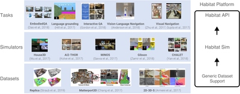 | [Habitat](https://arxiv.org/abs/1904.01201) | 2019 | High-performance photorealistic 3D simulator for embodied navigation, instruction following, and question answering. |
| 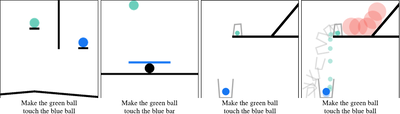 | [PHYRE](https://arxiv.org/abs/1908.05656) | 2019 | 2D classical-mechanics puzzles benchmarking sample-efficient physical reasoning. |
| 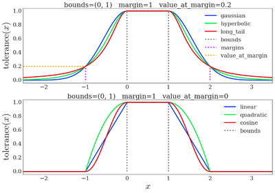 | [DM Control](https://arxiv.org/abs/1801.00690) | 2018 | MuJoCo-powered continuous-control tasks with standardized structure; de facto RL benchmark. |
| 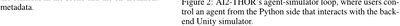 | [AI2-THOR](https://arxiv.org/abs/1712.05474) | 2017 | Near-photorealistic interactive 3D indoor scenes for visual AI, navigation, and object interaction. |

---

## Computer Use

Benchmarks for agents that interact with software — browsers, desktop GUIs, terminals, and codebases.

| Preview | Name | Year | Description |
| --- | --- | --- | --- |
|  | [BrowseComp](https://openai.com/index/browsecomp/) | 2025 | 1,266 short-answer questions requiring persistent browsing for hard-to-find, entangled information. |
| 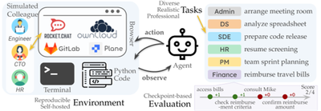 | [TheAgentCompany](https://arxiv.org/abs/2412.14161) | 2024 | Simulated software company evaluating agents on end-to-end professional workplace tasks. |
| 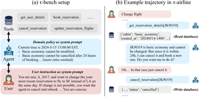 | [τ-bench](https://arxiv.org/abs/2406.12045) | 2024 | Simulated user–agent conversations testing tool use and policy adherence (retail, airline). |
| 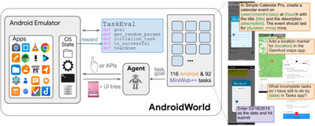 | [AndroidWorld](https://arxiv.org/abs/2405.14573) | 2024 | 116 dynamic, parameterized tasks across 20 real Android apps. |
| 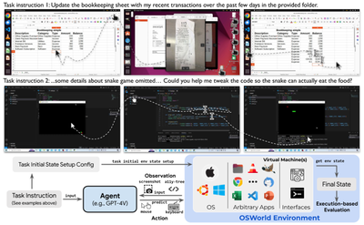 | [OSWorld](https://arxiv.org/abs/2404.07972) | 2024 | 369 real computer tasks across Ubuntu, Windows, and macOS for multimodal agents. |
| 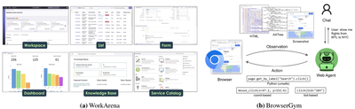 | [WorkArena](https://arxiv.org/abs/2403.07718) | 2024 | 33 ServiceNow-based enterprise tasks evaluating knowledge-worker web agents via BrowserGym. |
| 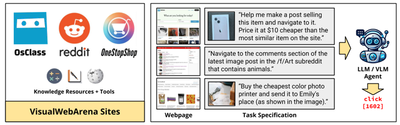 | [VisualWebArena](https://arxiv.org/abs/2401.13649) | 2024 | Realistic visually-grounded web tasks for evaluating multimodal agents. |
| 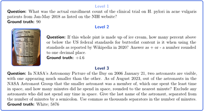 | [GAIA](https://arxiv.org/abs/2311.12983) | 2023 | Real-world assistant questions requiring reasoning, multimodality, web browsing, and tool use. |
|  | [SWE-bench](https://arxiv.org/abs/2310.06770) | 2023 | 2,294 real GitHub issues from 12 Python repos requiring multi-file code edits. |
| 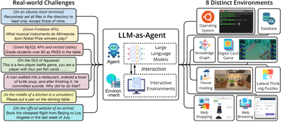 | [AgentBench](https://arxiv.org/abs/2308.03688) | 2023 | Multi-dimensional LLM-as-agent evaluation across 8 distinct interactive environments. |
| 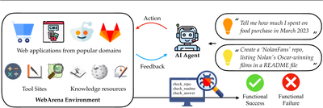 | [WebArena](https://arxiv.org/abs/2307.13854) | 2023 | Self-hostable realistic multi-site web environments for reproducible agent evaluation. |
| 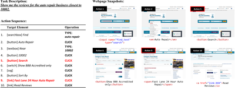 | [Mind2Web](https://arxiv.org/abs/2306.06070) | 2023 | Generalist web-agent tasks spanning 137 real websites across 31 domains. |
| 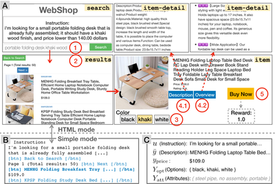 | [WebShop](https://arxiv.org/abs/2207.01206) | 2022 | Simulated e-commerce site with 1.18M products for instruction-following shopping agents. |
|  | [MiniWoB++](https://proceedings.mlr.press/v70/shi17a.html) | 2017 | Low-level keyboard/mouse web tasks with crowdsourced demos; foundational GUI-agent benchmark. |

---

## Contributing

PRs welcome. Please:
- Link the benchmark **Name** to its paper or primary reference.
- Keep the description to one or two sentences.
- Preserve reverse chronological order within each table.

---

## Related Work

Several curated lists overlap with this collection but emphasize different slices of the agent-evaluation landscape:

- [Awesome-General-Agents-Benchmark](https://github.com/supernalintelligence/Awesome-General-Agents-Benchmark) — 50+ benchmarks across general reasoning, agent tasks, domain skills (math/science/coding/web), multimodal, and safety; annotated with top-performer scores and human baselines.
- [awesome-ai-benchmarks](https://github.com/panilya/awesome-ai-benchmarks) — 114+ entries spanning programming, multimodal, translation, agent reasoning, and creative evaluation; paired with a searchable site at [aibenchmarks.net](https://aibenchmarks.net).
- [ai-agent-benchmark-compendium](https://github.com/philschmid/ai-agent-benchmark-compendium) — 50+ benchmarks for function-calling/tool use, general assistant/reasoning, coding, and computer interaction; heavy overlap with our *Computer Use* table.
- [Awesome-Robotic-Benchmarks](https://github.com/HaoranZhangumich/Awesome-Robotic-Benchmarks) — 30+ robotics benchmarks covering manipulation, locomotion, navigation, HRI, safety, simulation, and generalist tasks; finer sub-categories than our *Robotics* table.

In contrast, this list is scoped to **interactive decision-making environments**, with a focus on games, robotics, and computer use.
